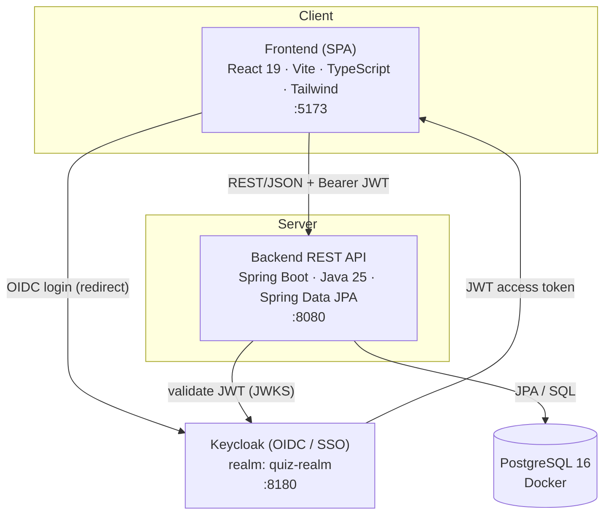
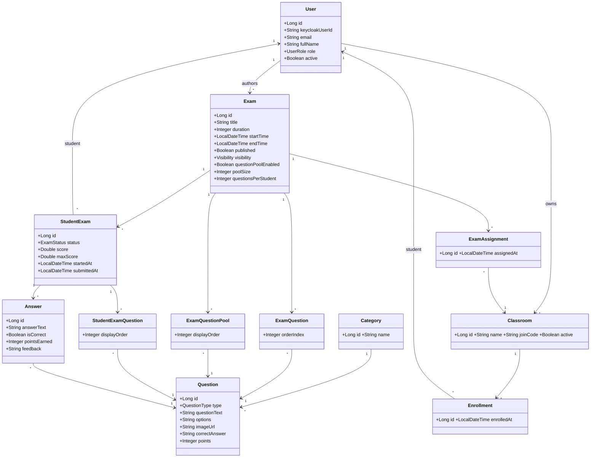

# Online Quiz and Exam System
### CSE 444 — Software Engineering II — Term Project Report

**Issue Number:** 1.0
**Issue Date:** June 19, 2026

**Prepared by**

- Alper Kaan Güler
- Furkan Filicioğlu
- Ömer Faruk Koç
- Yunus Emre Türk

---

## 1. Introduction

### 1.1 Project Title

**Online Quiz and Exam System** (internal product name: *QuizLab*) — a web-based platform for creating, delivering, and evaluating online quizzes and exams for university and school courses.

### 1.2 Team Members and Contributions

The project was developed by a four-person team. To keep responsibilities coherent, the system was decomposed into four subsystems, with one member owning each end to end while collaborating on shared interfaces. Cross-cutting decisions — the domain model, the API contract, the security model, and the design system — were made jointly and reviewed by the whole team.

| Member | Subsystem Ownership | Key Contributions |
| --- | --- | --- |
| **Furkan Filicioğlu** | Platform foundation & identity | Project skeleton and build setup; Keycloak integration and the authentication flow; login page; foundation of the admin and student panels; cross-cutting bug fixes. |
| **Ömer Faruk Koç** | Backend architecture & design system | Backend refactor and service-layer structure; the *Academic Precision* design system applied across all role flows; security hardening with `@PreAuthorize`; audit-log subsystem; analytics/statistics engine. |
| **Alper Kaan Güler** | Exam authoring & grading | Exam creation, scheduling, and management screens; automatic and partial-credit manual grading; question-management improvements; class-level statistics. |
| **Yunus Emre Türk** | Classes, assignment & documentation | Classroom, enrollment, and exam-assignment subsystem (class-based access control); Keycloak login theme and realm seed script; contributions to the frontend redesign; SRS and project documentation. |

All AI-assisted output was reviewed and approved by the team before being merged; no security-critical code was integrated without human review (see Section 8).

### 1.3 Project Overview

The Online Quiz and Exam System is a client–server web application that manages the full assessment lifecycle: instructors build a categorized question bank, compose and schedule exams, assign them to classes of students, and review results; students join classes with a code, take exams under a countdown timer, and view their graded results; administrators monitor the platform through system statistics and an audit log.

The system is organized around three roles — **Student**, **Instructor**, and **Admin** — that share a single identity layer provided by Keycloak. The frontend is a React/Vite single-page application; the backend is a Spring Boot REST API; PostgreSQL stores persistent data; and Keycloak handles authentication and role-based access. The end-to-end flow is:

> question bank → exam → assign to class → student takes exam → automatic / manual grading → statistics dashboard.

The prototype implements the complete assessment lifecycle, including bulk CSV question import, image-based questions, randomized question pools, automatic and partial-credit manual grading, per-exam and per-question analytics, a notification system, and an audit log.

### 1.4 Problem Statement

Instructors at individual or small-to-medium-scale institutions lack an assessment tool that fits their needs:

- **General-purpose form tools** (e.g. Google Forms) have no concept of a course-scoped question bank, exam scheduling, or role management, and offer only limited automatic grading.
- **Full learning-management platforms** (e.g. Moodle, Canvas) are heavyweight — more than an individual instructor or a small department needs, with scattered role and access management and a steep setup cost.

As a result, instructors struggle to control *which students can access which exam*, to reuse questions across exams, to combine automatic and manual grading, and to obtain meaningful item analytics. The Online Quiz and Exam System addresses this gap with a focused, identity-integrated platform built around course question banks, class-based exam assignment, and combined automatic/manual grading.

### 1.5 Project Objectives

The project set out to deliver:

- **Identity-integrated access.** Institutional single-sign-on via Keycloak, with role-based access control for students, instructors, and admins.
- **Course-scoped question bank.** A reusable, categorized question bank supporting multiple question types and bulk import.
- **Class-based exam delivery.** A *class → student → exam* assignment flow so that access is controlled per class rather than globally.
- **Combined grading.** Automatic grading for objective questions and a partial-credit manual-grading workflow for open-ended answers.
- **Secure exam taking.** Timed exams with auto-submit and protection against retaking a submitted exam.
- **Insightful reporting.** Per-exam and per-question analytics (difficulty, discrimination, distractor and score distributions).
- **Accountability.** An append-only audit log and a notification system for key events.

A secondary, course-specific objective was to apply software-engineering practice across the full SDLC and to document — transparently and critically — how AI tools were used throughout development (Section 8).

### 1.6 Target Users

The system serves three roles through three interface flows over one common identity layer:

- **Instructor.** Creates categories and questions (single or bulk), composes exams from those questions, organizes students into classes, assigns exams to classes, and analyzes results and item statistics.
- **Student.** Joins courses/classes with a join code, takes the exams and quizzes assigned to them within the allotted time window, and immediately views their results and per-question breakdown.
- **Admin.** Performs platform-wide oversight: system-wide statistics, role distribution, global category management, and an audit log of key actions.

---

## 2. Requirements Analysis

Requirements were elicited through AI-assisted question-and-answer sessions over the shared project brief, reviewed and validated by the team, and finally reconciled against the implemented system. The complete catalogue — 56 functional requirements (FR-001…FR-056), 19 non-functional requirements (NFR-001…NFR-019), 21 use cases, and 26 user stories with a full requirement-traceability matrix — is maintained in the project's *Software Requirements Specification* (`docs/yetdocs/SRS.md`). This section summarizes the requirements that drive the architecture and the highest-priority use cases.

### 2.1 Functional Requirements

Functional requirements are grouped into the following feature areas. Each row lists the area, representative requirements, and implementation status in the prototype.

| Area | Representative Functional Requirements | Status |
| --- | --- | --- |
| **Authentication & roles** | Authenticate via Keycloak; read roles from JWT; role-based navigation; Student/Instructor/Admin roles; account settings page. (FR-001–004, FR-056) | Implemented |
| **Question bank** | Create/edit/delete questions with ownership checks; multiple-choice, true/false, short-answer types; categories; per-question image upload. (FR-006–011, FR-055) | Implemented |
| **Exam management** | Create exams with title, description, duration, start/end time; add questions; publish/unpublish (requires ≥1 question); random question pool. (FR-012–017) | Implemented |
| **Exam taking** | List available exams; start an attempt only within the time window and with access; continue an in-progress attempt; prevent retakes; submit answers; auto-save. (FR-018–023) | Implemented |
| **Grading & results** | Auto-grade objective questions; partial-credit manual grading with feedback; compute and store scores; student/instructor result views with PDF export. (FR-024–029) | Implemented |
| **Reporting & analytics** | Result summaries; question-level statistics (difficulty, discrimination, distractor analysis); instructor analytics; admin system reports. (FR-030–033) | Implemented (admin reports partial) |
| **Administration** | View system-wide users/exams/questions/submissions; manage global categories; audit log of key actions; (in-app user activation/role assignment planned). (FR-034–038) | Partial |
| **Academic integrity & reliability** | Randomized delivery; preserve progress on interruption; atomic submission with time-expiry auto-submit; (proctoring planned). (FR-039–042) | Implemented (proctoring planned) |
| **Notifications** | Notify on new/assigned exam, graded result, upcoming exam, system announcement; unread count; mark-as-read. (FR-043–045) | Implemented |
| **Bulk operations & export** | Bulk-import questions via CSV; export result pages as PDF. (FR-046–047) | Implemented |
| **Classes, enrollment & assignment** | Instructor-owned classes; unique join code; student self-enrollment (no duplicates); view/remove members; PUBLIC vs. CLASSES exam visibility; server-side class-based access enforcement; targeted notifications. (FR-048–054) | Implemented |

### 2.2 Non-Functional Requirements

| Category | Key Non-Functional Requirements |
| --- | --- |
| **Security** | Authenticate before protected operations; enforce role-based access for student/instructor/admin functions; validate JWTs from the configured Keycloak realm; prevent any student from accessing another student's attempts or results. (NFR-001–004) |
| **Reliability** | Preserve submitted answers; avoid duplicate attempts after submission; recover gracefully from temporary token expiry; support auto-save to reduce data loss. (NFR-005–008) |
| **Usability** | Clear role-based navigation; an understandable exam-taking interface; comprehensible error messages. (NFR-009–011) |
| **Performance** | Load dashboards and exam pages acceptably for class-sized datasets; grade objective questions quickly after submission. (NFR-012–013) |
| **Maintainability** | Keep business logic in services; centralize frontend API access through helpers; keep documentation in sync with setup, auth, routes, and workflows. (NFR-014–016) |
| **Accessibility** | Usable across common desktop browsers; readable text and predictable navigation; keyboard-friendly exam and form screens. (NFR-017–019) |

### 2.3 Top-Priority Use Cases

The three use cases below were prioritized because they cover the system's core value proposition — secure, class-scoped exam delivery with combined grading.

#### UC-A — Take and Submit an Exam (Student)

- **Actor:** Student
- **Requirements:** FR-018, FR-019, FR-020, FR-021, FR-022, FR-042, FR-053
- **Preconditions:** The student is authenticated and enrolled in a class to which the exam is assigned (or the exam is PUBLIC); the current time is within the exam's window.
- **Main flow:**
  1. The student opens the dashboard and selects an available exam.
  2. The system verifies access (visibility/enrollment) and the time window on the server.
  3. If an in-progress attempt exists, the system resumes it; otherwise it creates a new attempt and delivers the question set (a random subset when a pool is configured).
  4. The student answers questions under a countdown timer; answers are auto-saved client-side.
  5. The student submits, or the timer expires and triggers an auto-submit.
  6. The system atomically persists all answers and marks the attempt as submitted, preventing any retake.

#### UC-B — Assign an Exam to Classes (Instructor)

- **Actor:** Instructor
- **Requirements:** FR-052, FR-053, FR-054
- **Preconditions:** The instructor owns the exam and at least one class.
- **Main flow:**
  1. The instructor opens an exam's detail page.
  2. The instructor sets visibility to *Selected classes* and chooses one or more owned classes (or chooses *Public*).
  3. The system saves the visibility setting and the class assignments.
  4. The server thereafter enforces, for both listing and attempt-start, that only enrolled students of the assigned classes can access the exam.
  5. A "new exam" notification is targeted to enrolled students of the assigned classes (or all students when PUBLIC).

#### UC-C — Grade an Exam: Automatic and Manual (System & Instructor)

- **Actors:** System (objective), Instructor (subjective)
- **Requirements:** FR-024, FR-025, FR-026, FR-027, FR-029
- **Preconditions:** A submitted attempt exists.
- **Main flow:**
  1. On submission, the system auto-grades multiple-choice and true/false answers by comparing them to the correct answers.
  2. A short answer that exactly matches the key (case- and whitespace-insensitive) is auto-graded; otherwise it is routed for manual review.
  3. The instructor reviews pending short answers and awards full, partial, or zero points with written feedback.
  4. The system recomputes per-answer points and the total score and stores the graded result, which becomes visible to the student.

### 2.4 Assumptions and Constraints

**Constraints**

- The backend must use Java and Spring Boot; the frontend must use React and TypeScript.
- Authentication must be integrated with Keycloak.
- Student, instructor, and admin responsibilities must remain separated.
- Documentation is a required project deliverable.
- The prototype is developed within a limited academic-project timeline.

**Assumptions**

- Keycloak is available and configured with the required realm, clients, and roles.
- PostgreSQL is available through Docker Compose during local development.
- Students and instructors have valid accounts.
- Instructors are responsible for authoring valid questions and exam configurations.
- A subset of advanced admin features (in-app user activation/deactivation and role assignment) is handled via the Keycloak admin console rather than the app UI.

---

## 3. System Design

### 3.1 System Architecture

The system follows a layered client–server architecture with a clear separation between presentation, business logic, identity, and persistence. The frontend is a single-page application that talks to the backend exclusively over REST/JSON; identity is fully delegated to Keycloak; and PostgreSQL is the system of record.



**Design principles**

- **REST-only frontend–backend coupling.** The SPA reaches the backend only through REST endpoints with a bearer JWT; there is no direct database or server-side session coupling.
- **Identity delegated to Keycloak.** The application stores no passwords and keeps no server-side session — it only *validates* JWTs issued by the configured realm (OAuth2 resource server). Roles are read from the token.
- **Stateless backend.** Each request carries its own credentials; the backend authorizes via Spring Security method security (`@PreAuthorize`) plus per-resource ownership checks.
- **One-command developer environment.** `docker compose up` brings up PostgreSQL and a pre-seeded Keycloak realm together, so the system is reproducible from a clean checkout.

The implemented system comprises **14 domain entities, 12 REST controllers exposing 72 endpoints, 8 service classes, 14 JPA repositories**, and a **24-page** frontend.

### 3.2 Domain Model and Class Design

The domain is organized around three clusters: **identity & content** (User, Category, Question), **exam composition** (Exam, ExamQuestion, ExamQuestionPool), and **delivery & assessment** (Classroom, Enrollment, ExamAssignment, StudentExam, StudentExamQuestion, Answer). AuditLog and Notification are cross-cutting. The class diagram below covers the entities behind the top-priority use cases (exam taking, class assignment, grading).



**Key design notes**

- **Dual identity.** Each user is anchored to a Keycloak subject (`keycloakUserId`); exams, questions, classes, attempts, and enrollments also store the relevant Keycloak id (`keycloakInstructorId`, `keycloakCreatorId`, `keycloakUserId`). Keycloak subject IDs and local numeric IDs are treated as distinct identity concepts.
- **`ExamAssignment` as a link entity.** Rather than coupling exams directly to classrooms, a dedicated `ExamAssignment` join entity models the many-to-many *exam ↔ class* relationship, keeping assignment independent of exam content and supporting a clean PUBLIC/CLASSES visibility switch.
- **Per-student question delivery.** When a question pool is enabled, `ExamQuestionPool` holds the full pool and `StudentExamQuestion` records the randomized subset actually delivered to each student, so each attempt is reproducible and independently gradable.
- **Enumerations.** `UserRole {STUDENT, INSTRUCTOR, ADMIN}`, `QuestionType {MULTIPLE_CHOICE, TRUE_FALSE, SHORT_ANSWER}`, `Exam.Visibility {PUBLIC, CLASSES}`, `StudentExam.ExamStatus {NOT_STARTED, IN_PROGRESS, SUBMITTED, GRADED}`, and a four-value `NotificationType`.

### 3.3 Database Design

The relational schema in PostgreSQL maps one table per entity (JPA/Hibernate). The core tables and relationships are:

| Table | Purpose | Key Relationships / Constraints |
| --- | --- | --- |
| `users` | Local mirror of Keycloak identities | unique `keycloak_user_id`, unique `email`, `role` enum |
| `categories` | Question categories | referenced by `questions` |
| `questions` | Question bank | FK → `categories`; `type` enum; `options` (JSON text); `image_url` |
| `exams` | Exam definitions | FK → `users` (instructor); `visibility` enum; pool fields |
| `exam_questions` | Fixed exam ↔ question links | FK → `exams`, `questions`; `order_index` |
| `exam_question_pool` | Pool of candidate questions | FK → `exams`, `questions`; `display_order` |
| `classrooms` | Instructor-owned classes | unique `join_code`; FK → `users` (instructor) |
| `enrollments` | Student ↔ class membership | FK → `classrooms`; unique (class, student) to block duplicates |
| `exam_assignments` | Exam ↔ class assignment | FK → `exams`, `classrooms` |
| `student_exams` | A student's attempt | FK → `exams`, `users`; `status` enum; `score`, `max_score` |
| `student_exam_questions` | Per-attempt delivered questions | FK → `student_exams`, `questions`; `display_order` |
| `answers` | Submitted answers | FK → `student_exams`, `questions`; `is_correct`, `points_earned`, `feedback` |
| `notifications` | Per-user notifications | `keycloak_user_id`; `type` enum; `is_read`, `is_archived` |
| `audit_logs` | Append-only action trail | `entity_type`, `entity_id`, `actor_*`, `action`, `payload` (indexed) |

The audit log records the actor (Keycloak id and name), the action, the affected entity, and a timestamp for each key operation — `CREATE · UPDATE · DELETE · PUBLISH · GRADE · ASSIGN`.

### 3.4 User Interface Design

The UI applies a single design system — **"QuizLab / Academic Precision"** — across all role flows: the Manrope typeface, a navy/indigo palette, and a role-aware sidebar/shell that surfaces only the actions permitted for the signed-in role. The 24 pages are organized by role:

- **Common:** Home/login entry, Settings (profile + link to the Keycloak account console), Notifications.
- **Student:** Dashboard, Student Classes (join by code), Take Exam, My Results, Exam Result (with PDF export).
- **Instructor:** Dashboard, All Exams, Create Exam, Exam Detail (question assignment + visibility/class assignment), Add Questions to Exam, Exam Preview, Question Bank (with image upload), Bulk Import, Category Management, Instructor Classes, Class Detail, Manual Grading, Exam Results, Exam Statistics.
- **Admin:** Admin Dashboard, Admin Exam Detail.

The exam-taking screen prioritizes reliability and clarity: a visible countdown timer, client-side auto-save, a submit confirmation, and an auto-submit on expiry.

### 3.5 Traceability to Requirements

Design decisions trace directly back to requirements:

| Design Element | Satisfies |
| --- | --- |
| Keycloak OIDC + JWT resource server; `@PreAuthorize` + ownership checks | FR-001–005, NFR-001–004 |
| `ExamAssignment` link entity + `Visibility` enum + server-side access guard | FR-052, FR-053, UC-B |
| `ExamQuestionPool` + `StudentExamQuestion` (per-student random subset) | FR-016, FR-039, UC-A |
| `StudentExam.status` lifecycle + atomic submission service | FR-020, FR-021, FR-042, UC-A |
| `GradingService` + manual-grading recompute on `answers` | FR-024–027, UC-C |
| Analytics over `answers` / `student_exams` | FR-031, FR-032 |
| `AuditLog` entity + audit service | FR-038, NFR-001 |
| `Notification` entity + targeted dispatch | FR-043–045, FR-054 |
| Role-aware UI shell (24 pages) | FR-003, NFR-009 |

---

## 4. Implementation

### 4.1 Technologies, Frameworks, and Tools

| Layer | Technology | Version |
| --- | --- | --- |
| **Frontend** | React | 19.2 |
| | TypeScript | 6.0 |
| | Vite (build/dev server) | 8.0 |
| | React Router | 7.1 |
| | Axios (HTTP client) | 1.7 |
| | keycloak-js (OIDC adapter) | 23.0 |
| | lucide-react (icons) | 1.11 |
| | Styling | Hand-authored CSS with design tokens (Manrope typeface; no utility framework) |
| **Backend** | Java | 25 |
| | Spring Boot | 4.0.6 |
| | Spring Web MVC, Spring Data JPA, Bean Validation | (Spring Boot starters) |
| | Spring Security + OAuth2 Resource Server | (JWT validation) |
| | Spring WebSocket | (starter present; reserved for future real-time features) |
| | keycloak-admin-client | 23.0 |
| | Lombok | (boilerplate reduction) |
| **Identity** | Keycloak (realm `quiz-realm`, custom login theme + seed) | 23 |
| **Database** | PostgreSQL | 16 |
| **Infrastructure** | Docker Compose (PostgreSQL + Keycloak) | — |
| **Build** | Maven (backend), npm (frontend) | — |
| **AI assistants** | Claude Code, Codex, Google Stitch | — |

> Note: although an earlier presentation listed Tailwind CSS, the implemented frontend uses hand-authored CSS (design tokens / CSS variables), not a utility-class framework.

### 4.2 Development Environment

The project is designed to run from a clean checkout with minimal setup:

1. **Infrastructure** — `docker compose up -d` starts PostgreSQL 16 and Keycloak 23. The `quiz-realm` (clients, roles, and default test users) is seeded automatically, and Spring Boot's `spring-boot-docker-compose` integration wires the backend to these containers during local runs.
2. **Backend** — `./mvnw spring-boot:run` builds and starts the Spring Boot API on `http://localhost:8080`. On first run, a `DataInitializer` creates local test users if the database is empty.
3. **Frontend** — `npm install` then `npm run dev` starts the Vite dev server on `http://localhost:5173`.

Default local endpoints: frontend `:5173`, backend `:8080`, Keycloak `:8180`. Source control is Git/GitHub; the team worked on feature branches integrated through pull requests, with line endings normalized via `.gitattributes` to avoid cross-platform churn.

### 4.3 Major Components and Modules

**Backend (12 controllers, 8 services, 14 repositories, 14 entities).**

- **Controllers** expose the REST surface (72 endpoints): `Exam`, `Question`, `ExamQuestion`, `QuestionPool`, `StudentExam`, `Answer`, `Result`, `Classroom`, `Notification`, `Category`, `Upload`, and `Admin`.
- **Services** hold the business logic kept out of controllers:
  - `GradingService` — automatic grading for objective questions and score computation.
  - `ExamSubmissionService` — atomic submission and grading of an attempt.
  - `QuestionPoolService` — per-student random subset selection.
  - `ClassroomService` — classes, join codes, enrollment, and exam assignment.
  - `NotificationService` — event notifications with targeted dispatch.
  - `AuditLogService` — append-only audit trail.
  - `KeycloakService` / `UserSyncService` — identity lookups and local-user synchronization.
- **Persistence** — 14 Spring Data JPA repositories, one per entity, over the PostgreSQL schema described in §3.3.
- **Security** — `SecurityConfig` configures the OAuth2 resource server (JWT validation against the realm) and method security; sensitive endpoints are guarded with `@PreAuthorize` plus per-resource ownership checks.

**Frontend (24 pages).**

- `App.tsx` defines the routes; `AuthContext` initializes Keycloak and exposes auth state; `api/axios.ts` centralizes the HTTP client and injects the bearer token on every request.
- A role-aware shell (sidebar/top bar) renders navigation per role, and pages are grouped by role as described in §3.4. Larger pages delegate data fetching to custom hooks to keep view logic thin.

### 4.4 Key Implementation Decisions

- **Delegate identity entirely to Keycloak.** The application validates JWTs and never stores passwords or server-side sessions. This simplified the security model and enabled SSO, at the cost of a dual-identity mapping between Keycloak subjects and local user rows.
- **Enforce access on the server, not just the UI.** Class-based exam access (`Visibility.CLASSES`) is enforced server-side for both listing exams and starting an attempt, so route hiding in the SPA is a convenience, not the security boundary.
- **Make submission atomic.** A dedicated submission service persists all answers and finalizes the attempt in one operation, with a time-expiry auto-submit, to prevent partial saves and data loss (FR-042).
- **Reproducible per-student exams.** When a pool is enabled, the delivered subset is recorded in `StudentExamQuestion`, so the exact exam a student saw can be re-graded and analyzed deterministically.
- **Keep business logic in services.** Grading, pooling, classroom, notification, and audit logic live in service classes (NFR-014), keeping controllers thin and testable.
- **Audit by default.** Sensitive actions (`CREATE/UPDATE/DELETE/PUBLISH/GRADE/ASSIGN`) write an audit entry with actor and timestamp, supporting accountability without scattering logging across controllers.

### 4.5 AI Tools Used During Development

Three AI tools were used, each with a distinct role (analyzed critically in Section 8):

- **Claude Code** — the primary pair-programmer: backend and frontend code, refactoring, debugging, documentation, security hardening, and tooling. The most heavily used tool across the project.
- **Codex** — architecture discussions and decision points: "X vs. Y" alternatives, entity-relationship trade-offs, and API-contract decisions (e.g. the choice to model exam–class assignment via a dedicated `ExamAssignment` link entity).
- **Google Stitch** — UI/UX generation: the QuizLab design-system layout, palette suggestions, and page mockups, which the team approved and then translated into React with Claude Code.

In all cases, AI produced drafts; the team reviewed, decided, and validated. No code — especially security-critical code — was merged without human review.

---

## 5. Testing and Validation

### 5.1 Testing Strategy

Testing on this project was **primarily manual and exploratory** rather than driven by a formal, up-front test plan. As features were built, team members exercised the application end to end through each role (instructor, student, admin), reproducing realistic workflows and recording the problems they found. A single backend smoke test (`SystemApplicationTests`) verifies that the Spring application context loads; beyond that, the project does not yet have an automated test suite.

We treat this candidly as a limitation rather than a strength (see §5.4 and Section 7): automated coverage lagged behind development speed, and a CI test gate is the first item on the quality roadmap. What the manual approach *did* provide was effective defect discovery — the role-based walkthroughs surfaced concrete correctness, authorization, and usability issues that were then fixed.

### 5.2 Test Activities

- **Role-based end-to-end walkthroughs.** Each major flow was exercised by hand: question authoring and bulk import, exam creation and publishing, class creation/enrollment/assignment, exam taking under the timer, automatic and manual grading, and results/analytics.
- **Authorization probing.** Unauthorized-access attempts were tried manually — accessing another instructor's exam by ID, retaking a submitted exam, accessing another student's results — to confirm the server-side guards hold.
- **Defect logging.** Findings were collected in a manual QA checklist (`docs/alperdocs/TEST_RAPORU.md`), organized by role flow (Instructor / Student / Admin / General), which served as the working defect backlog.

### 5.3 Representative Defects and Resolutions

The manual QA pass surfaced a range of issues; the table below lists representative examples and how they were resolved. The corresponding requirements are now marked *Implemented* in the SRS.

| # | Defect Found (manual QA) | Resolution | Requirement |
| --- | --- | --- | --- |
| 1 | An exam with no questions could be published | Publishing now requires at least one question | FR-015 |
| 2 | Another instructor's exam could be edited by knowing its ID | Added instructor ownership checks; critical fields locked once an exam is active | FR-017 |
| 3 | A submitted exam could be retaken | Attempt status now blocks retaking a submitted/graded exam | FR-021 |
| 4 | Refreshing the page lost all in-progress answers | Added client-side auto-save with restore on reload | FR-023 |
| 5 | Short-answer questions were not graded and the student wasn't told why | Added a manual-grading workflow with partial credit and feedback; pending state shown | FR-026 |
| 6 | "Top X%" percentile label was inverted | Corrected the percentile calculation | FR-030 |
| 7 | "Export as PDF" did not work | Implemented print-friendly PDF export of result pages | FR-047 |
| 8 | Rapid repeated clicks sent duplicate requests | Buttons are disabled while a request is in flight | NFR-006 |

### 5.4 Defects Identified and Outstanding

Most functional and authorization defects from the manual pass were resolved and are reflected in the current requirement statuses. The known remaining gaps are quality-of-engineering rather than feature defects:

- No automated regression/integration test suite (only a context-load smoke test) and no CI test gate.
- Some date/time comparisons rely on the browser clock rather than a synchronized server clock.
- Server-side persistence of in-progress answers is not yet implemented (auto-save is client-side only).

These are carried forward as future work in Section 7.

---

## 6. Deployment and Usage

### 6.1 Deployment Approach

The project targets a **containerized local/development deployment**. Infrastructure dependencies — PostgreSQL and Keycloak — are provisioned through Docker Compose, while the backend and frontend run as standard Spring Boot and Vite processes. Spring Boot's `spring-boot-docker-compose` integration automatically connects the backend to the Compose-managed database and Keycloak during local runs, and the `quiz-realm` is seeded (clients, roles, default users) so the environment is reproducible from a clean checkout.

A production deployment would build the frontend to static assets served behind a web server/CDN, package the backend as an executable JAR (or container image), point both at a managed PostgreSQL instance and a hardened Keycloak deployment, and serve everything over HTTPS. Production hardening (tightened CORS, secrets management, externalized configuration) is noted as future work in Section 7.

### 6.2 Installation and Execution

**Prerequisites:** Docker, Java 25 (JDK), and Node.js + npm.

1. **Start infrastructure (PostgreSQL + Keycloak):**
   ```bash
   cd backend
   docker compose up -d
   ```
2. **Run the backend** (Spring Boot API on `http://localhost:8080`):
   ```bash
   cd backend
   ./mvnw spring-boot:run
   ```
3. **Run the frontend** (Vite dev server on `http://localhost:5173`):
   ```bash
   cd frontend
   npm install
   npm run dev
   ```

Default endpoints — frontend `http://localhost:5173`, backend `http://localhost:8080`, Keycloak `http://localhost:8180`. Default seeded test accounts include an instructor, a student, and an admin (credentials are documented in `KEYCLOAK_SETUP.md`).

### 6.3 System Screenshots

Full-resolution screenshots of the QuizLab interface across all main role flows are provided as supporting artifacts in the submission ZIP, under the directory:

> `design/` — one subfolder per screen (e.g. `design/quizlab_landing_page/screen.png`, `design/quizlab_öğrenci_paneli/screen.png`, `design/quizlab_eğitmen_paneli/screen.png`, `design/quizlab_soru_bankası/screen.png`, `design/quizlab_yeni_sınav_oluştur/screen.png`, `design/quizlab_sınav_çözme_çoktan_seçmeli/screen.png`, `design/quizlab_sınav_sonucu/screen.png`, `design/quizlab_sınav_i_statistikleri/screen.png`, `design/quizlab_admin_paneli/screen.png`).

These screens reflect the implemented "Academic Precision" design system; the frontend was built as an exact-match implementation of them. They are referenced rather than embedded here to keep the report concise; the corresponding screens are listed by name in §3.4. The system architecture and domain-model diagrams (Figures 3.1 and 3.2) are retained inline as they are essential to understanding the design.

### 6.4 Demonstration Scenario

A representative end-to-end demonstration (~3–4 minutes) exercises all three roles and the full assessment lifecycle:

1. **Admin login (Keycloak SSO)** — single sign-on and role-based redirection to the admin panel; system statistics and audit log.
2. **Instructor** — select/create a category, author questions, create an exam, and assign it to a class (visibility = CLASSES).
3. **Student** — log in, see the assigned exam, and take it under the countdown timer; submit before time expires.
4. **Automatic grading → result screen** — the student immediately sees their score with a per-question and category breakdown; export to PDF.
5. **Instructor analytics** — open *Exam Statistics* to review discrimination index, item difficulty, and class average; demonstrate manual grading of an open-ended answer with partial credit and feedback.

This scenario demonstrates the complete flow — *question bank → exam → class assignment → student attempt → automatic/manual grading → analytics* — and the role-based access boundaries between the three user types.

---

## 7. Maintenance and Future Improvements

### 7.1 Known Limitations

The prototype covers the full assessment lifecycle, but the following limitations are acknowledged:

- **In-app admin user management is incomplete.** Activating/deactivating users and assigning roles is currently done through the Keycloak admin console rather than the application UI.
- **Auto-save is client-side only.** In-progress answers are preserved in browser `localStorage`; server-side persistence of in-progress answers is not yet implemented.
- **No proctoring/live monitoring** during exams.
- **Admin reporting is basic** — system totals plus the audit log, short of a full reporting suite.
- **Time handling relies on the browser clock** in places, rather than a synchronized server clock.
- **No automated test suite or CI gate** beyond a context-load smoke test (see Section 5).
- **Production hardening is pending** — e.g. some permissive development settings and CORS configuration should be tightened before a real deployment.

### 7.2 Potential Enhancements

- **Real-time exam notifications and anti-cheat controls** — live, exam- and system-related notifications and integrity safeguards during active exams (the WebSocket starter is already in place for this).
- **Question-bank analytics over time** — grow the question pool and track each item's difficulty and discrimination metrics longitudinally.
- **PDF gradebooks and class-level reports** — exportable, class-level reporting for instructors.
- **Multi-tenant architecture** — isolation across institutions/departments to move the platform from single-institution to multi-institution use.
- **Server-side auto-save and server-clock synchronization** — close the reliability gaps noted above.
- **Automated testing and CI** — a regression/integration suite with a CI test gate, defined as a per-phase exit criterion.

### 7.3 Scalability and Maintainability Considerations

- **Stateless, horizontally scalable backend.** Because authentication is delegated to Keycloak and the API holds no server-side session, backend instances can be scaled out behind a load balancer without sticky sessions.
- **Clear layering.** Business logic is concentrated in service classes and persistence in JPA repositories, so behavior can evolve without leaking into controllers or the UI (NFR-014). Frontend API access is centralized through a single Axios client, keeping token handling and endpoints in one place (NFR-015).
- **Decoupled assignment model.** Modeling exam–class assignment through a dedicated link entity keeps assignment independent of exam content, easing future changes to visibility and targeting rules.
- **Reproducible environment.** Docker Compose plus a seeded realm makes environments reproducible and onboarding fast, which supports long-term maintainability.
- **Documentation as a deliverable.** The SRS, setup guides, and this report are kept in-repo and updated alongside the code (NFR-016).

The most important maintainability investment going forward is the automated test suite and CI gate: the project's own experience (Section 5, Section 8) showed that without it, regressions are caught late and manually.

---

## 8. Reflection on AI Usage

AI tools were central to how this project was built, and we use this section to document — transparently and critically — what they did well, where they fell short, and what we learned about working with them.

### 8.1 AI Tools Utilized

| Tool | Role | Where it was used |
| --- | --- | --- |
| **Claude Code** | Primary pair-programmer | Backend and frontend code, refactoring, debugging, documentation, security hardening, and translating approved designs into React. The most heavily used tool. |
| **Codex** | Architecture sounding board | "X vs. Y" alternatives, entity-relationship trade-offs, and API-contract decisions. |
| **Google Stitch** | UI/UX generation | Design-system layout, palette suggestions, and page mockups for the QuizLab interface. |

### 8.2 Tasks Supported by AI Across the Lifecycle

AI was applied at every SDLC phase, but with deliberately different levels of trust:

- **Requirements analysis.** We fed the shared project brief into AI and, through back-and-forth discussion, derived user stories and the SRS. Every generated document was reviewed and approved by the whole team.
- **Architecture design.** Starting from the requirements, the backend team decided the architecture; AI helped enumerate alternatives and trade-offs (entity relationships, layering, API contract).
- **UI/UX design.** Design direction (dark/light theme, palette, academic tone) was debated by the team; Stitch then generated home-page variations from AI-written prompts, one was chosen, and the rest of the pages were produced from it — downloaded as both visuals and code for team approval.
- **Implementation.** AI drafted CRUD endpoints, boilerplate, and test skeletons, which humans reviewed and corrected.
- **Testing.** Errors and stack traces were given to AI for root-cause hypotheses; humans then verified and fixed.
- **Documentation (continuous).** The SRS, API notes, Keycloak seed docs, and handover notes were produced with AI assistance.

The governing rule was constant: *AI prepared drafts; the team reviewed and decided; nothing was merged unread.*

### 8.3 What We Delegated vs. What We Kept

| AI-heavy | Human-controlled |
| --- | --- |
| CRUD endpoints | Grading logic |
| Test skeletons | Architectural decisions |
| Documentation | Authorization checks |
| Boilerplate | "Why is it this way" decisions |

Security-critical code — authorization, token handling, audit trails, and grading logic — was written and carefully reviewed by humans rather than left to AI defaults.

### 8.4 Benefits Obtained

- **Speed and parallelism.** AI let us write backend and frontend in parallel and move quickly through boilerplate, CRUD, and scaffolding.
- **Design acceleration.** Stitch produced a coherent visual language (Manrope, navy/indigo) far faster than designing from scratch, which Claude Code then turned into a consistent, role-aware UI across 24 pages.
- **Better-informed decisions.** Using Codex as a sounding board surfaced trade-offs (e.g. modeling exam–class assignment as a dedicated link entity) that improved the design.
- **Documentation leverage.** A substantial, consistent documentation set (SRS, setup, handover) was produced alongside the code rather than after it.

### 8.5 Challenges Encountered

The project's real story was one of three phases, and the challenges are best understood through it:

- **Phase 1 — Fast start.** We began coding before scope and roles were settled. AI made parallel, rapid progress feel safe ("we'll fix it later").
- **Phase 2 — Problems surface.** The first end-to-end tests revealed inconsistent UI, ambiguous permissions, and undefined scope. The problems were not one-offs — they were architectural: each fix spawned another.
- **Phase 3 — Recovery.** A full code review, the introduction of the QuizLab/Academic Precision design system, role clarification, and the audit log brought the project back to a coherent state.

Concretely, the recurring challenges were:

- **Scope creep.** Class-based access control was not in the initial plan; adding it mid-development disrupted the existing entity model.
- **Late role clarity.** Instructor/student/admin permission boundaries were only written down once they began to clash in end-to-end testing.
- **UI/UX inconsistency.** Different members wrote different pages; without a design system, components visually diverged.
- **Integration/merge friction.** A stable API contract was defined late, so frontend and backend expected different things from the same endpoints.
- **Testing discipline lagged.** Automated testing fell behind the pace of AI-accelerated coding — the clearest evidence of why a "spec-first" approach matters when coding fast with AI.

### 8.6 Critical Evaluation of AI-Generated Outputs

Working this way taught us where AI-assisted development is risky, and we record these as deliberate cautions:

- **Plausible-but-wrong output.** AI confidently produces code that compiles and reads well but is semantically wrong or misses an edge case. Example: the first draft of the `StudentExam` submit endpoint looked correct, but the team caught a race-condition risk and fixed it manually before merging.
- **Automation bias.** As AI output proves useful, the team starts trusting it by default; review becomes a formality and subtle bugs slip through.
- **Domain decisions are not delegable.** AI does not know your users, your pedagogy, or your institutional rules. Scope and value decisions must stay with humans — for instance, the entity-relationship decision for exam–class assignment was made by the team after weighing Codex's options, not handed to the tool.
- **Security-critical code is risky to delegate.** Authorization, token management, and audit trails are not AI defaults; they require human authorship and careful review.
- **Dependency and cost.** API cost, latency, rate limits, and vendor lock-in are real risks; over-reliance on a single AI tool is itself a technical risk.

**If we did it again**, we would adopt an AI-native but discipline-first workflow: use AI Q&A to produce a project vision document and an explicit in-scope/out-of-scope list *first*; write no code until roles are clear; proceed phase by phase (spec → implement → test → demo → approve) before starting the next; and run a short retro after each phase asking "what did we delegate to AI, and which of those were wrong?" The core lesson is that *gaining speed with AI does not replace planning discipline — it makes it more critical.*

---

## 9. Conclusion

### 9.1 Summary of Achievements

The team delivered a working Online Quiz and Exam System that covers the complete assessment lifecycle for three roles. Measured against the objectives of Section 1.5, the prototype provides: Keycloak-based SSO with role-based access; a categorized question bank with three question types, bulk CSV import, and image-based questions; exam authoring with scheduling and randomized question pools; a class → student → exam assignment model with server-side, class-based access control; combined automatic and partial-credit manual grading; per-exam and per-question analytics; a notification system; an append-only audit log; and a consistent, role-aware UI.

In numbers, the implemented system comprises **14 domain entities, 12 controllers exposing 72 REST endpoints, 8 service classes, 14 repositories, and 24 frontend pages** — built and documented over a single academic term.

### 9.2 Lessons Learned

- **Spec first, then phase.** Define scope and roles before coding, split the work into phases, and finish and test each phase before moving on. Skipping this is what produced our mid-project recovery effort.
- **"AI can build it" ≠ "we need it."** Scope decisions cannot be delegated to AI.
- **A stable API contract and branch isolation saved our parallel work** — and defining the contract late was a recurring source of friction.
- **A mid-project code review is expensive — but, done in time, it rescued the project.**
- **Testing discipline is the contract for closing a phase, not a separate phase** — and it was the one we most underinvested in.

### 9.3 Final Remarks

The project succeeded both as a product — a focused, identity-integrated assessment platform that fills a real gap between lightweight form tools and heavyweight LMS platforms — and as a learning experience in AI-assisted software engineering. AI tools made the team dramatically faster, but the project's value came from human judgment: deciding scope, owning the architecture, securing the critical paths, and reviewing every AI-generated change. The most durable takeaway is that AI amplifies a team's engineering discipline rather than substituting for it — and that the discipline we add next (a spec-first workflow and an automated test/CI gate) is exactly what will make the next iteration of this system both faster and safer to build.
